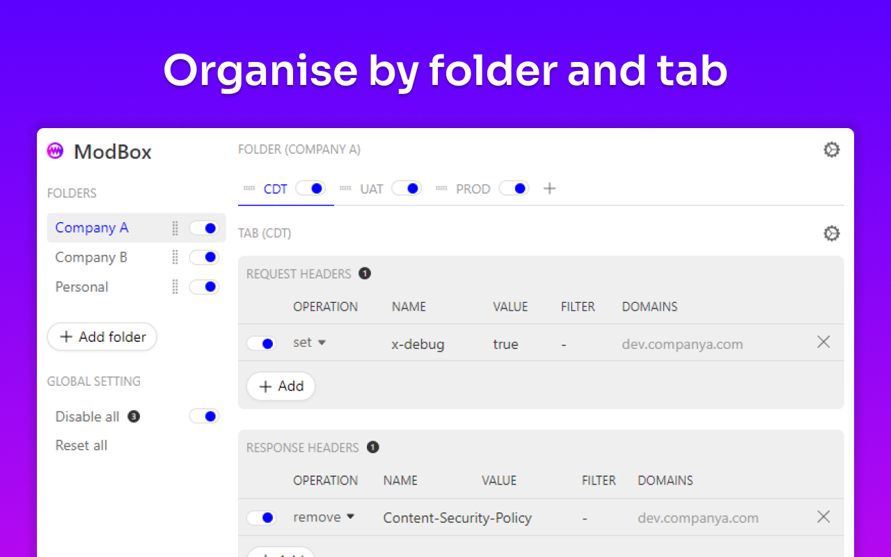

# ModBox
A compact and easy to use extension for modifying HTTP request & response headers and blocking HTTP requests.

## Features
- Create rules to modify HTTP request and response headers
- Create rules to block HTTP request & even block entire sites
- Create rules to redirect requests to your own assets
- Scope your tabs and rules to specific domains and url criteria
- Organise your rules by a folder and tab structure, with drag'n'drop and clone
- Quickly toggle individual rules, tabs, folders and globally
- No tracking, no commercial version, no funny business

## Links

- [Chrome web store](https://chromewebstore.google.com/detail/modbox-%E2%80%93-modify-headers-b/ohlllhelckdghejidfhlklehaoibjkla)

- [Tip Jar](https://buymeacoffee.com/robphillips)