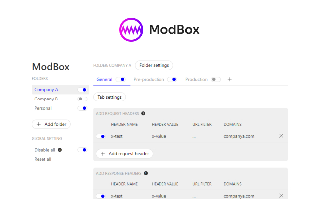

# ModBox
A compact and easy to use extension for modifying HTTP request & response headers and blocking HTTP requests.

## Features
- Create rules to modify HTTP request and response headers
- Create rules to block HTTP request & even block entire sites
- Scope your tabs and rules to specific domains and url criteria
- Organise your rules by a folder and tab structure, with drag'n'drop and clone
- Quickly toggle individual rules, tabs, folders and globally
- No tracking, no commercial version, no funny business